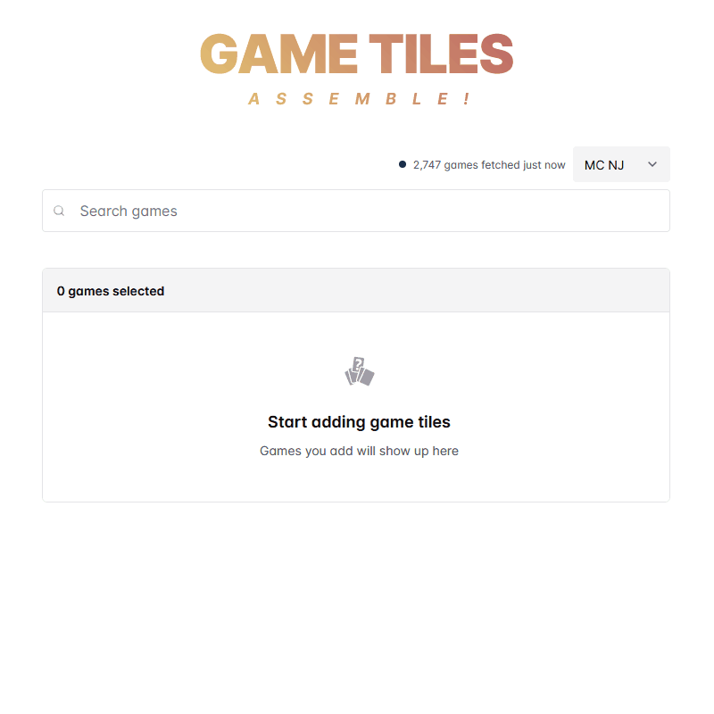

# Game Tiles, Assemble! [![Vercel Deploy][vercel-image]][vercel-url]

[vercel-image]: https://deploy-badge.vercel.app/vercel/gametiles
[vercel-url]: https://vercel.com/joshjaviers-projects/gametiles/deployments

> assemble game tiles (pretty) fast

This is a simple tool that streamlines the process of assembling [game tiles](https://betmgm-manila-cms-docs.netlify.app/docs/builds/Game-Tiles).



## Features

- ⚡️ Fetching game metadata is fast
- 🌈 Switch between brands/states via dropdown or URL
- ✨ Find games faster with fuzzy search and autosuggest
- 🌸 Clean UI with dark mode
- 🥷 No VPN needed

## Run Locally

```bash
git clone https://github.com/joshjavier/game-tile-assistant
cd game-tile-assistant
npm install

# Rename `vercel.json` to prevent a bug with Vercel and React Router
mv vercel.json vercel.json.tmp

# Start the dev server
npx vercel dev
```

**Note:** Do **not** stage/commit changes to `vercel.json`. There is a [bug with Vercel and React Router](https://github.com/joshjavier/game-tile-assistant/issues/2) that causes errors when developing locally, and temporarily renaming `vercel.json` is the best workaround that I've tried so far.

## Built with

- [React](https://react.dev/)
- [Redux+TS template for Vite](https://github.com/reduxjs/redux-templates/blob/master/packages/vite-template-redux/README.md)
- [Chakra UI](https://chakra-ui.com/)
- [MiniSearch](https://lucaong.github.io/minisearch/)
- [React Autosuggest](https://react-autosuggest.js.org/)
- [React Code Block](https://react-code-block.netlify.app/)

## Author

[@joshjavier](https://github.com/joshjavier)

## License

[MIT](LICENSE) &copy; Josh Javier
